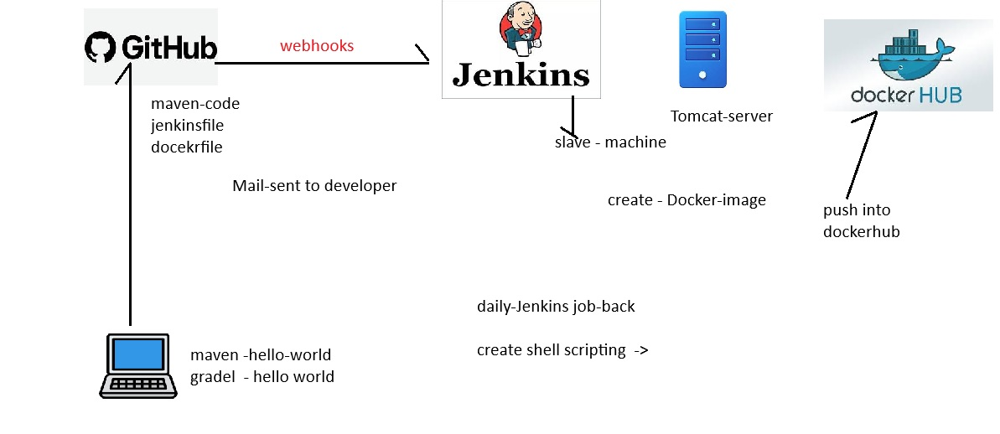

create ansible playbook to install jenkins- master
create a playbook to configure slave machine
    (create user ,provide permission) install docker make group docekr and $USER    

MAVEN PROJECT  in local machine

create github-repo -> push local maven pro into github

jenkins -> build a pipeline and freestyle

while building time need to received mail  success or failear
configure webhooks in that project

deploy into tomcat webserver and tomcat docker image (razak,vinoth,asaraf,sheik,mukund,kalai,thoufik,arumugam,sathiya,abinaya,jenisha,praveen,purushoth,dharashni,arun,online,swetha,yuva,pranitha)

backup the tail jobs

