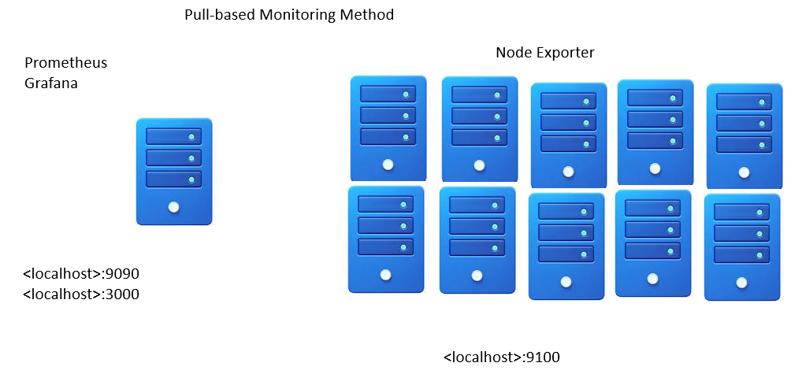

# Monitoring in DevOps

## 📌 What is Monitoring?
Monitoring is the continuous process of **observing, collecting, and analyzing system metrics** to ensure applications, infrastructure, and services are running smoothly.  
It helps detect failures early, optimize performance, and maintain reliability in production environments.

---
# Types of Monitoring and List of Monitoring Tools

Monitoring helps organizations track the health, performance, availability, and security of systems and applications.  
Different types of monitoring focus on different areas of the IT environment.

---

# 1. Infrastructure Monitoring

## Definition
Infrastructure monitoring tracks the health and performance of physical and virtual infrastructure components.

## What is Monitored?
- CPU usage
- Memory usage
- Disk space
- Server uptime
- VM performance
- Container health

## Example
Monitoring an AWS EC2 server to ensure CPU usage does not exceed 85%.

## Popular Tools
| Tool | Description |
|---|---|
| **Nagios** | Traditional infrastructure monitoring tool with alerting capabilities |
| **Zabbix** | Open-source monitoring for servers, networks, and applications |
| **Prometheus** | Metrics-based monitoring and alerting, ideal for cloud-native apps |
| **Datadog** | Cloud-native infrastructure and application monitoring |
| **AWS CloudWatch** | AWS resource monitoring and logging service |

---

# 2. Application Monitoring (APM)

## Definition
Application Performance Monitoring (APM) tracks application behavior, performance, and user interactions.

## What is Monitored?
- Response time
- Error rates
- API latency
- Database queries
- Application crashes

## Example
Tracking login API response time in a banking application.

## Popular Tools
| Tool | Description |
|---|---|
| **New Relic** | Full-stack observability platform |
| **Dynatrace** | Automated application monitoring with AI insights |
| **AppDynamics** | Enterprise-grade APM solution |
| **Elastic APM** | Performance monitoring integrated with Elastic Stack |
| **Datadog APM** | Real-time application monitoring and tracing |

---

# 3. Network Monitoring

## Definition
Network monitoring tracks network performance, availability, and connectivity between systems.

## What is Monitored?
- Network traffic
- Packet loss
- Latency
- Bandwidth usage
- Router and switch health

## Example
Detecting high latency between branch offices and data centers.

## Popular Tools
| Tool | Description |
|---|---|
| **SolarWinds NPM** | Enterprise network monitoring platform |
| **PRTG Network Monitor** | Real-time network monitoring solution |
| **Wireshark** | Packet analysis and troubleshooting tool |
| **Nagios** | Network and server monitoring |
| **ManageEngine OpManager** | Network device monitoring and visualization |

---

# 4. Log Monitoring

## Definition
Log monitoring analyzes logs generated by applications, servers, operating systems, and security devices.

## What is Monitored?
- Error logs
- Access logs
- Security logs
- Authentication failures
- Application events

## Example
Detecting repeated failed login attempts in a web application.

## Popular Tools
| Tool | Description |
|---|---|
| **Splunk** | Enterprise log analytics and SIEM solution |
| **Elasticsearch** | Log storage and search engine |
| **Logstash** | Collects and processes logs |
| **Kibana** | Visualizes logs and metrics |
| **Graylog** | Centralized log monitoring and analysis |

---

# 5. Synthetic Monitoring

## Definition
Synthetic monitoring uses automated scripts to simulate user activities and test application availability.

## What is Monitored?
- Website uptime
- Login workflows
- API availability
- Checkout process
- DNS response time

## Example
A bot checks every 5 minutes whether a website login page is working.

## Popular Tools
| Tool | Description |
|---|---|
| **Pingdom** | Website uptime and performance monitoring |
| **Uptrends** | Website and API monitoring |
| **Catchpoint** | Synthetic monitoring and testing |
| **Site24x7** | Website and application monitoring |
| **Grafana Synthetic Monitoring** | Synthetic tests integrated with Grafana dashboards |

---

# 6. Real User Monitoring (RUM)

## Definition
Real User Monitoring tracks actual user interactions with websites and applications.

## What is Monitored?
- Page load time
- User session performance
- Browser performance
- Geographic performance
- Mobile app responsiveness

## Example
Tracking slow page loads experienced by users in different countries.

## Popular Tools
| Tool | Description |
|---|---|
| **Datadog RUM** | Real user web monitoring |
| **New Relic Browser** | User experience monitoring |
| **AppDynamics End-User Monitoring** | Frontend user experience tracking |
| **Google Analytics** | Website user behavior analysis |
| **Elastic RUM** | User telemetry and monitoring |

---

# 7. Security Monitoring

## Definition
Security monitoring tracks security events, vulnerabilities, threats, and suspicious activities.

## What is Monitored?
- Unauthorized access
- Malware activity
- Failed login attempts
- Firewall logs
- Intrusion detection

## Example
Detecting unusual login activity from unknown IP addresses.

## Popular Tools
| Tool | Description |
|---|---|
| **IBM QRadar** | SIEM and threat detection |
| **Splunk Enterprise Security** | Threat detection and response |
| **Wazuh** | Open-source SIEM and security monitoring |
| **ArcSight** | Security analytics solution |
| **OSSEC** | Host-based intrusion detection system |

---

# 8. Cloud Monitoring

## Definition
Cloud monitoring tracks cloud-based infrastructure, services, and applications.

## What is Monitored?
- Cloud resources
- Auto-scaling
- Cloud storage
- Serverless functions
- Cloud databases

## Example
Monitoring AWS Lambda execution failures.

## Popular Tools
| Tool | Description |
|---|---|
| **AWS CloudWatch** | AWS cloud monitoring |
| **Azure Monitor** | Azure resource monitoring |
| **Google Cloud Operations Suite** | GCP monitoring solution |
| **Datadog Cloud Monitoring** | Multi-cloud observability |
| **Prometheus + Grafana** | Kubernetes and cloud-native monitoring |

---

# 9. Database Monitoring

## Definition
Database monitoring tracks database performance, health, and query execution.

## What is Monitored?
- Query performance
- Database uptime
- Slow queries
- Replication lag
- Connection count

## Example
Monitoring slow SQL queries in MySQL.

## Popular Tools
| Tool | Description |
|---|---|
| **Percona PMM** | MySQL and MongoDB monitoring |
| **Oracle Enterprise Manager** | Oracle DB monitoring |
| **SQL Server Profiler** | SQL Server monitoring |
| **SolarWinds DPM** | Database performance monitoring |
| **pgAdmin + Prometheus Exporter** | PostgreSQL metrics collection |

---

#  Summary Table

| Monitoring Type | Purpose | Example Tools |
|---|---|---|
| Infrastructure Monitoring | Server and system health | Prometheus, Nagios, Zabbix |
| Application Monitoring | App performance and APIs | New Relic, Dynatrace |
| Network Monitoring | Network traffic and latency | SolarWinds, Wireshark |
| Log Monitoring | Log analysis and troubleshooting | Splunk, ELK Stack |
| Synthetic Monitoring | Simulated user testing | Pingdom, Uptrends |
| Real User Monitoring | Actual user experience | Datadog RUM, New Relic |
| Security Monitoring | Threat and attack detection | QRadar, Wazuh |
| Cloud Monitoring | Cloud resource monitoring | CloudWatch, Azure Monitor |
| Database Monitoring | Database performance | Percona PMM, Oracle EM |

---

#  Conclusion
Monitoring is essential in modern IT and DevOps environments because it helps teams:
- Detect issues quickly  
- Improve system reliability  
- Maintain application performance  
- Enhance user experience  
- Prevent downtime  

Different monitoring types focus on different areas of the infrastructure, while monitoring tools provide visibility, alerts, dashboards, and analytics to help teams operate systems efficiently.
